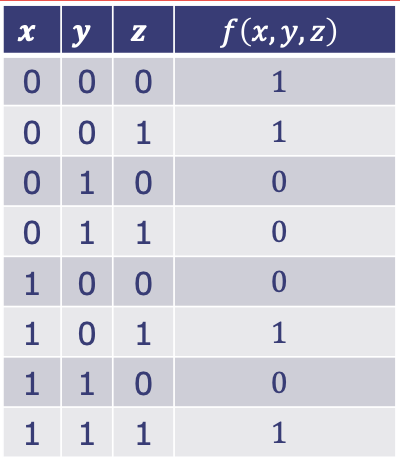

## 1. Combinational Logic

### 1.1. Digital Logic

- Digital logic is a subfield of electronics in which voltages are interpreted as either 1 or 0 and generate output information as also 1's or 0's.
- There are two broad types of digital logic:
    1. **Functions:** 
        $$ f(x_0, x_1, x_2) $$
        - Digital functions are stateless (i.e., the current output is based only on current inputs, meaning the output is not a function of time).
    2. **Storage**
        $$ Q(t) = f(Q(t-1), x(t)) $$
        - The current output is based on past inputs.

### 1.2. Digital Functions
- A digital function is a mapping from \( \mathbb{B} \rightarrow \mathbb{B} \), which can be expressed using Boolean algebra:
    - \( \mathbb{B} = \{ 0, 1 \} \).
    - Operations are: 
        1. \( a \mid b \) (logical OR),  
        2. \( \neg a \) (logical NOT),  
        3. \( a \land b \) (logical AND).
- Digital functions can be represented graphically as truth tables.
- We can reduce all high-level operations to combinations of simple logical operations (like AND, OR, NOT, XOR), which is known as logical reduction.
- These gates actually do things! All high-level algorithms need to find their basic implementations in these fundamental functions. For example:
    1. If 0, 1 are numbers, XOR performs base-2 addition.
    2. If 0 means positive and 1 means negative, XOR performs sign determination of multiplication.
    3. XOR expresses the if/else check (if A equals 1, then output is not B; else, output is B).
    4. XOR checks if A is not equal to B.
    5. And many more.
- In general, there are \( 2^{2^n} \) possible \( n \)-bit digital functions.
- In practice, we want to find a digital function that describes a desired logical behavior. One way to specify a digital function in an algebraic form is sum-of-products:
    1. First create the truth table.
    2. Next write each row where the output is 1 as a product of inputs. (using AND).
    3. Now combine them as a sum (using OR) to get the final expression.
    - e.g.,  
    {:width="40%"}  
    Then, $$ f(x, y, z) = \overline{x} \overline{y} \overline{z} + \overline{x} y \overline{z} + x \overline{y} \overline{z} + x y \overline{z} $$