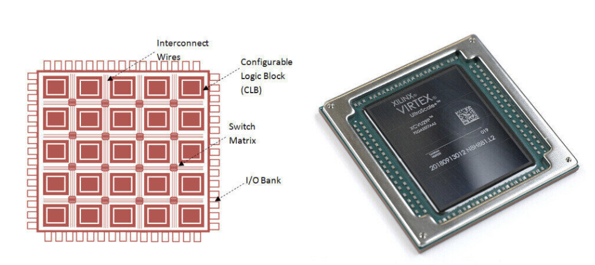
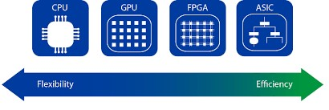
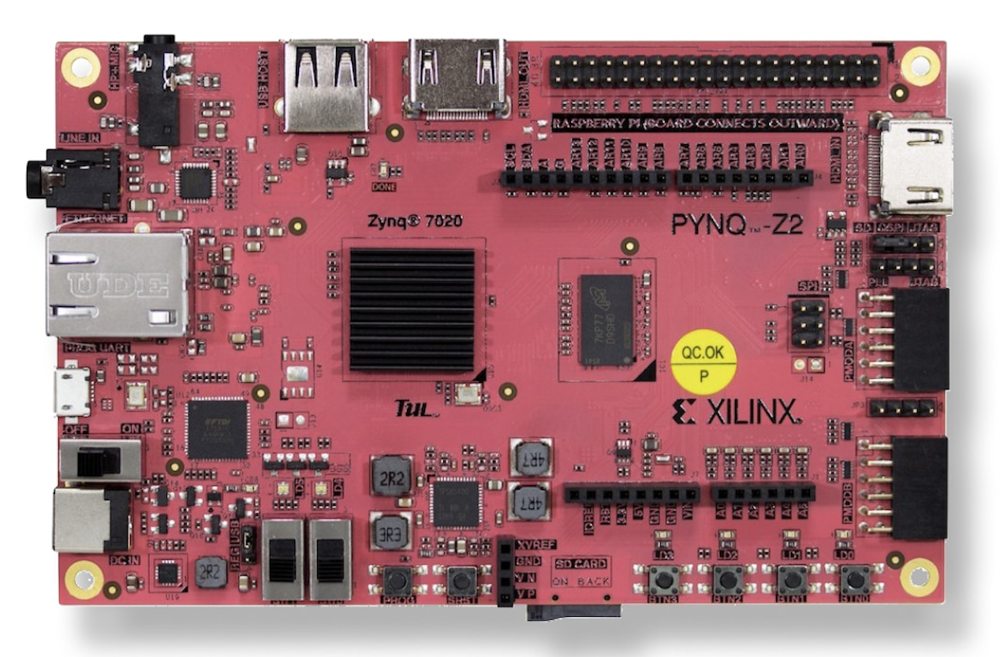

# Digital Design & FPGA

This tutorial series explores Digital Design and FPGA programming using the PYNQ-Z2 board and SystemVerilog. Each chapter will cover key concepts along with practical examples.

## 0. Introduction

### 0.1. What is an FPGA?

In a traditional CPU, the circuit is fixed. To perform different tasks, we run different software, making CPUs general-purpose and versatile. However, this general-purpose nature comes at the cost of speed and efficiency.



This is where **Field-Programmable Gate Arrays (FPGAs)** come in. An FPGA consists of a large array of primitive blocks (i.e., logic gates), memory, and other specialized harware, each of which is programable and are interconnected using programmable interconnects. Unlike a CPU, we can program (and even reprogram repeatedly) an FPGA to define how these blocks work together, allowing for highly optimized and application-specific circuit designs.

### 0.2. Where to Use an FPGA

FPGAs are useful in various scenarios (but not always!), including:

1. **High-Speed & Efficient Processing**: When speed and efficiency are top priorities, such as in hardware accelerators and stream processors.
2. **Custom Performance & Power Efficiency**: When general-purpose architectures hinder performance, cost, or power efficiency.
3. **Massive Parallelism**: When executing many small tasks simultaneously.
4. **Prototyping**: Before manufacturing an ASIC, we can test and refine our design on an FPGA.
5. **Post-Moore’s Law Computing**: Since transistor scaling has slowed, the industry is shifting towards domain-specific architectures like FPGAs to continue improving performance.



### 0.3. What  is PYNQ-Z2



Here, we are going to use the PYNQ-Z2 development board by TUL electronics. Which is based on AMD Xilinx 7020 System on Chip (SoC). The SoC contains two ARM Cores (PS - Processing System), and PL - Programble Logic (the actual FPGA), which are connected through the AXI interface.

In the PL, there are 85k logic cells, 4.9MB block RAM, and 220 DSP slices, which makes this relatively afforadble board quite powerful.

A rather intresting feature of this board is the its simplified interface using Python Jupiter notebooks with a PYNQ image (which is not strictly necessary). However, we will use the borad in this way.

### 0.4. HDL

An Hardware Desctiption Language is used to describe digital logic circuits and systems.

In this course we use **SystemVerliog** as our HDL of chioce. Eventhough Verilog can be used to for both simulate and synthesis, we will only use Verilog for synthesis. For simulations, we will use a Python library named **cocotb**. As an IDE we use **Vivado**.

### 0.4. Getting Started ...

1. Set up the PYNQ dev board.

Here is the official guide: [PYNQ-Z2 Setup Guide](https://pynq.readthedocs.io/en/v2.3/getting_started/pynq_z2_setup.html)

2. Downaload and install Vivado.

Vivado is a large and not-so-polished software that is only available for x86 Linux and Windows. However, we need it to create overlays, but there's no other option. 😐

[Vivado Download](https://www.xilinx.com/support/download.html)

#### 0.5. Blinky! 🙂

Remark: Python profeciency is assumed.

Now, if you have successfully booted your PYNQ-Z2 board with the PYNQ image, navigate to the Jupyter server, create a new folder named projects, and then create a new Jupyter Notebook file named Blinky.ipynb

First, import the required modules. FPGAs use overlays, which are binary configuration files with a .bit suffix. These overlays define how the FPGA logic is structured and how it interacts with the rest of the system. We’ll discuss them in detail later, but for now, let’s proceed with our Blinky! project.

This script controls the four onboard LEDs, blinking them sequentially while a switch is turned on.

```python
from pynq.overlays.base import BaseOverlay
from time import sleep
```
```python
base = BaseOverlay("base.bit")
```
```python
leds = [base.leds[i] for i in range(0, 4)]
switches = [base.switches[i] for i in range(0, 2)]
```
```python
while (True):
    while(switches[0].read() == True):
        for led in leds:
            led.on()
            sleep(0.15)
            led.off()
        sleep(0.3)
        continue
    continue
```

Now run the code and turn on the SW0! 👾

[Our Blinky!](_img/blinky.mov)